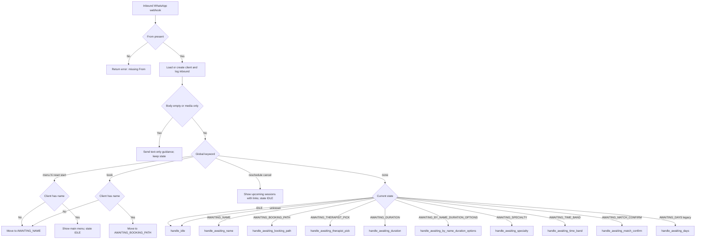
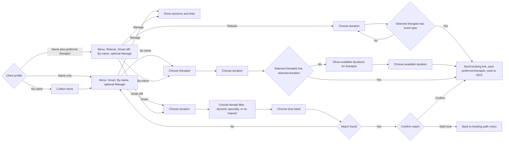

# WhatsApp Bot Flow Decision Tree

This document captures the current WhatsApp bot runtime flow in two clean views:
- Diagram 1: request router and state dispatch
- Diagram 2: booking funnel details

## Diagram 1: Request router and state dispatch

## Diagram 2: Booking funnel

## Notes

- Inbound handling is synchronous by default (`WHATSAPP_WEBHOOK_SYNC_ENABLED=true`).
- The user-facing reply is sent inline in the same webhook request cycle.
- Optional follow-up nudges can be queued in Celery after booking-link completion when enabled.
- For unnamed clients, name capture is strict prompt-first (`AWAITING_NAME`) before saving.
- `Reschedule / Cancel` menu options are shown only when upcoming sessions exist.
